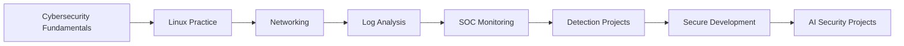

<div align="center">


<br>


</div>

<br>

```bash
┌──(tharindi㉿github)-[~/cyber-profile]
└─$ cat identity.txt

Name        : Tharindi Weerasinghe
Role        : Cybersecurity Undergraduate
Location    : Sri Lanka
Focus       : SOC Monitoring | Linux | Python | Secure Development | AI Security
Mindset     : Learn deeply, build practically, document clearly
```

---

## ACCESS PROFILE

```yaml
profile:
  name: Tharindi Weerasinghe
  role: Cybersecurity Undergraduate
  location: Sri Lanka
  status: Learning | Building | Improving

current_focus:
  - SOC monitoring and alert investigation
  - Linux security labs and log analysis
  - Python security tools and automation
  - Network traffic analysis
  - Secure web application development
  - AI-powered security projects
  - Documentation and technical communication

learning_style:
  - Build practical projects
  - Break problems into simple steps
  - Learn from errors and debugging
  - Document what I understand
  - Improve consistently
```

---

## CURRENT OPERATIONS

<table>
<tr>
<td width="50%">

### Security Labs

```text
> SSH brute force detection with Splunk
> Wazuh and Suricata SOC monitoring lab
> Linux authentication log analysis
> Network scanning and packet inspection
> Security alert investigation practice
```

</td>
<td width="50%">

### Development Projects

```text
> AI resume security analyzer
> Credit card fraud detection dashboard
> Event ticket booking web application
> Python security utilities
> Database-backed web applications
```

</td>
</tr>
</table>

---

## TECH STACK

<div align="center">


</div>

<br>

<div align="center">


</div>

---

## FEATURED PROJECT MAP

```text
[01] SSH Brute Force Detection Lab with Splunk
     └─ SOC detection lab using Linux auth logs, SPL queries, alerts and dashboarding

[02] SentinelLab: Wazuh and Suricata SOC Lab
     └─ Blue team monitoring lab with Wazuh, Suricata, Ubuntu and Kali Linux

[03] AI Resume Security Analyzer
     └─ Flask tool for privacy risk, PII exposure and suspicious URL analysis

[04] Credit Card Fraud Detection
     └─ Machine learning dashboard for detecting suspicious transaction patterns

[05] Packet Sniffer
     └─ Python packet analysis project for learning network traffic behavior

[06] Network Scanner
     └─ Local network discovery and port scanning for authorized environments

[07] Password Strength Checker
     └─ Basic security tool for password strength analysis and suggestions

[08] NexMeet Event Ticket Booking
     └─ Spring Boot and MySQL web application with booking functionality
```

---

## LEARNING PATH



---

## AREAS I AM BUILDING

<table>
<tr>
<td width="33%">

### Blue Team

```text
SOC monitoring
Log analysis
Alert review
SIEM basics
Threat detection
```

</td>
<td width="33%">

### Security Engineering

```text
Python tools
Secure coding
OWASP basics
Automation
Documentation
```

</td>
<td width="33%">

### Systems

```text
Linux
Networking
MySQL
Spring Boot
Flask
```

</td>
</tr>
</table>

---

## GITHUB SIGNALS

<div align="center">


</div>

<br>

<div align="center">


</div>

---

## CURRENT COMMAND

```bash
┌──(tharindi㉿github)-[~/growth]
└─$ ./build_future.sh

[*] Strengthening cybersecurity fundamentals
[*] Building practical labs and projects
[*] Improving Linux, networking and secure coding
[*] Writing better documentation
[*] Preparing for internship opportunities
[+] Status: Still learning, still building, still improving
```

---

## CONNECT

<div align="center">

<a href="https://tharindi-weerasinghe.github.io/portfolio/">
  
</a>

<a href="https://github.com/Tharindi-Weerasinghe">
  
</a>

<a href="https://www.linkedin.com/in/tharindi-weerasinghe-0b543a2b7/">
  
</a>

<a href="mailto:tharindimaleesha0@gmail.com">
  
</a>

</div>

---

<div align="center">

```text
Learning in public. Building with purpose. Improving one project at a time.
```


</div>
